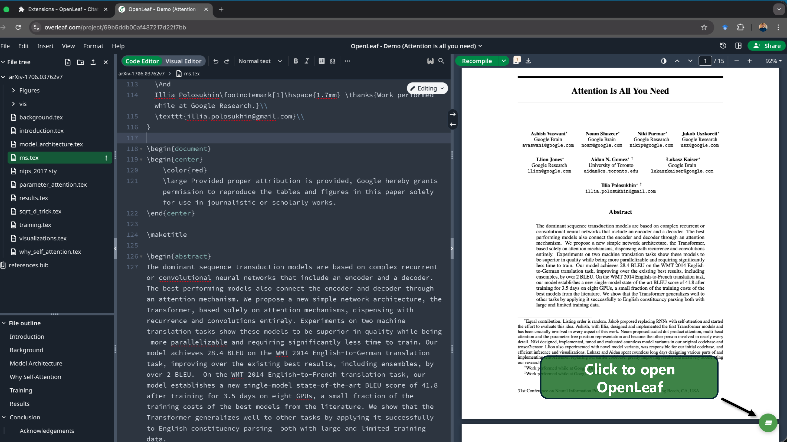
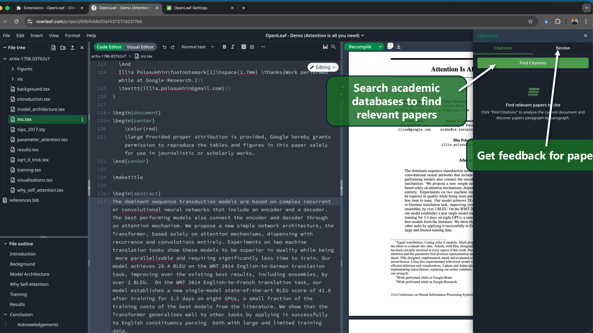
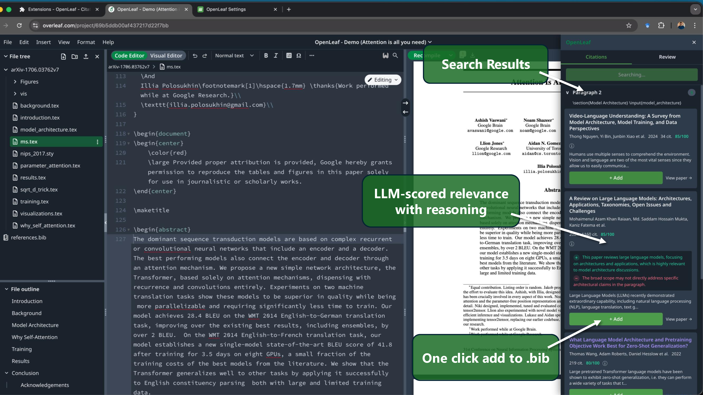
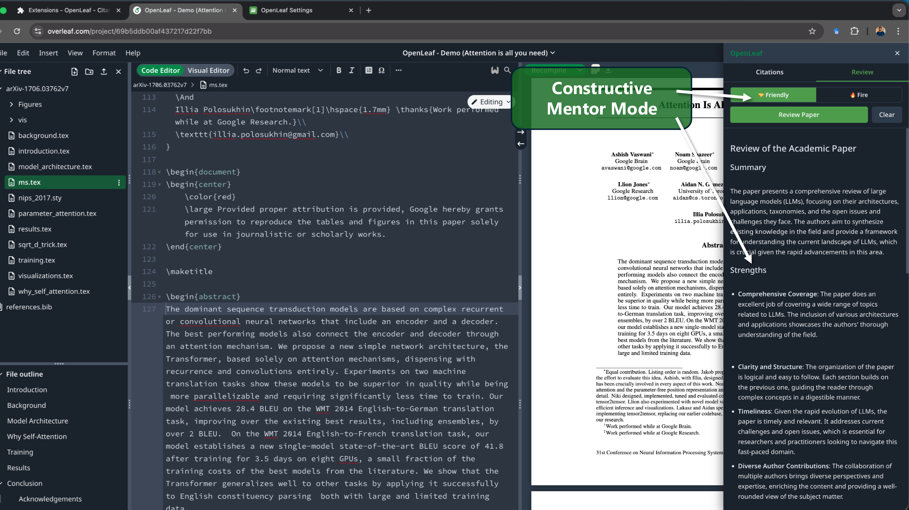
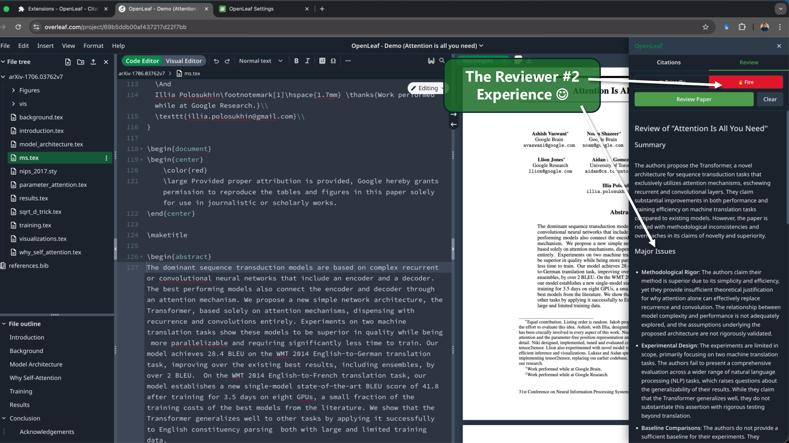
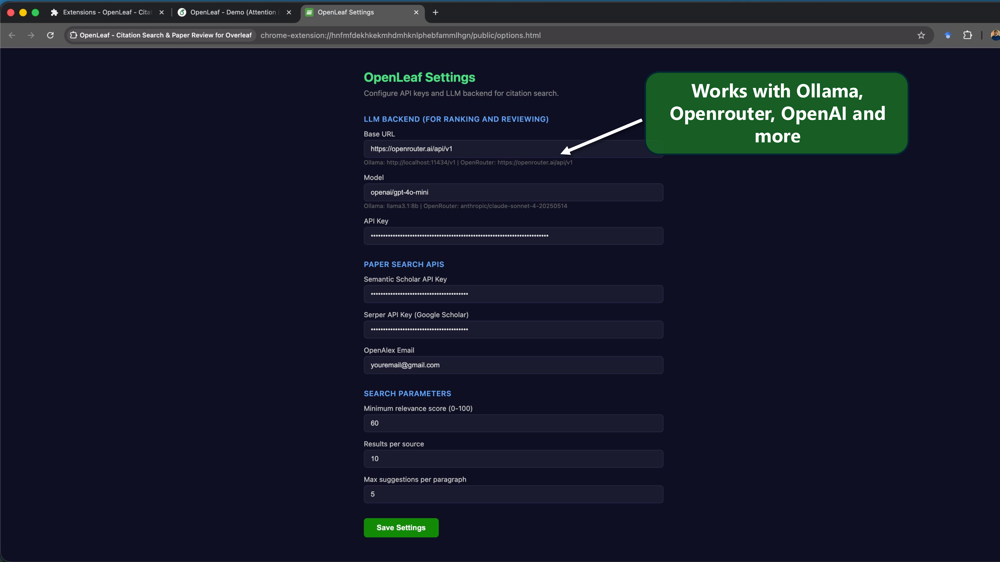

<p align="center">
  
</p>

<h1 align="center">OpenLeaf</h1>
<p align="center"><strong>AI-powered citation search & paper review for Overleaf</strong></p>
<p align="center">Find relevant papers to cite and get feedback on your writing, without leaving the editor.</p>

<p align="center">
  
</p>

## How it works

1. Open any project on overleaf.com
2. Click the green **OpenLeaf** button in the bottom-right corner
3. **Citations tab** — click "Find Citations" to discover papers paragraph by paragraph, scored 0-100 with LLM reasoning
4. **Review tab** — get AI feedback on your paper in Friendly (constructive) or Fire (Reviewer #2) mode
5. Click **+ Add** to append BibTeX entries to your `.bib` file automatically

### Click to open OpenLeaf


### Citation search — find papers paragraph by paragraph


### LLM-scored results with reasoning


### Friendly review — constructive mentor


### Fire review — the Reviewer #2 experience


### Configure your LLM and API keys


## Browser support

OpenLeaf is a Manifest V3 web extension. A single Chromium build serves **Chrome, Opera, and Edge**; **Safari** is built from the same source through Apple's converter.

| Browser | Supported | How |
|---------|-----------|-----|
| Chrome  | ✅ | Web Store, or load unpacked |
| Opera   | ✅ | Load unpacked, or the Chromium zip |
| Edge    | ✅ | Load unpacked, or the Chromium zip |
| Safari 16.4+ | ✅ | Build the Xcode project (macOS, needs Xcode) |

## Install

### Chrome / Edge — Web Store
[openleaf extension link](https://chromewebstore.google.com/detail/openleaf-citation-search/jjcmeicpmfcimamdmchabfpjcljieafk)

### Chrome / Opera / Edge — load unpacked
1. Download the latest `openleaf-chromium-vX.Y.Z.zip` from [Releases](https://github.com/demfier/openleaf/releases) and unzip it (or build it yourself — see [From source](#from-source-chromium)).
2. Open your browser's extensions page:
   - Chrome / Edge: `chrome://extensions`
   - Opera: `opera://extensions`
3. Enable **Developer mode**.
4. Click **Load unpacked** and select the unzipped folder.

### Safari (macOS)
Safari runs the same extension wrapped in a small native app, which you build once with Xcode:

```bash
git clone https://github.com/demfier/openleaf.git
cd openleaf
npm install
npm run package:safari    # generates an Xcode project under safari/
```

> Requires the full **Xcode** app, not just the Command Line Tools. If the converter is missing, install Xcode from the App Store, run
> `sudo xcode-select -s /Applications/Xcode.app/Contents/Developer`, then re-run the command.

Then:
1. Open the generated project in `safari/` with Xcode.
2. **Product → Run** to build and install the app.
3. For locally-built (unsigned) extensions, enable Safari's **Develop → Allow Unsigned Extensions**, then turn on **OpenLeaf** under **Safari → Settings → Extensions**.

### From source (Chromium)
```bash
git clone https://github.com/demfier/openleaf.git
cd openleaf
npm install
npm run build      # outputs to dist/
```
Then load unpacked (see above), selecting the **repo root** folder. To produce a distributable zip instead, run `npm run package:chromium` → `web-ext-artifacts/openleaf-chromium-vX.Y.Z.zip`.

## Configuration

Click the extension icon → **Options** (or right-click → Options) to configure:

### LLM Backend (for citation ranking & paper review)

Works with any OpenAI-compatible API:

| Backend | Base URL | API Key? |
|---------|----------|----------|
| Ollama (default) | `http://localhost:11434/v1` | No |
| vLLM | `http://your-server:8000/v1` | Optional |
| OpenAI | `https://api.openai.com/v1` | Yes |
| OpenRouter | `https://openrouter.ai/api/v1` | Yes |
| Together | `https://api.together.xyz/v1` | Yes |
| Groq | `https://api.groq.com/openai/v1` | Yes |

> **Ollama on Mac/Linux:** By default, Ollama blocks requests from browser extensions. You need to allow Chrome extension origins before starting Ollama:
> ```bash
> OLLAMA_ORIGINS=chrome-extension://* ollama serve
> ```
> To set this permanently:
> ```bash
> launchctl setenv OLLAMA_ORIGINS "chrome-extension://*"
> ```
> Then restart Ollama. Without this, the reviewer will return a 403 error.

### Paper Search APIs

- **Semantic Scholar** — works without key (rate-limited)
- **Serper** (Google Scholar) — optional, skipped if no key
- **OpenAlex** — no key needed, email improves rate limits

## Development

```bash
npm run dev               # build + watch mode
npm run build             # one-off build → dist/
npm run package:chromium  # zip for Chrome/Opera/Edge → web-ext-artifacts/
npm run package:safari    # Xcode project for Safari → safari/ (needs Xcode)
```

After changing code, reload the extension from your browser's extensions page (`chrome://extensions` or `opera://extensions`). For Safari, re-run the app from Xcode.

## Privacy

See [PRIVACY.md](PRIVACY.md). TL;DR: No data collection, no analytics, no accounts. Everything stays in your browser.

## License

MIT
